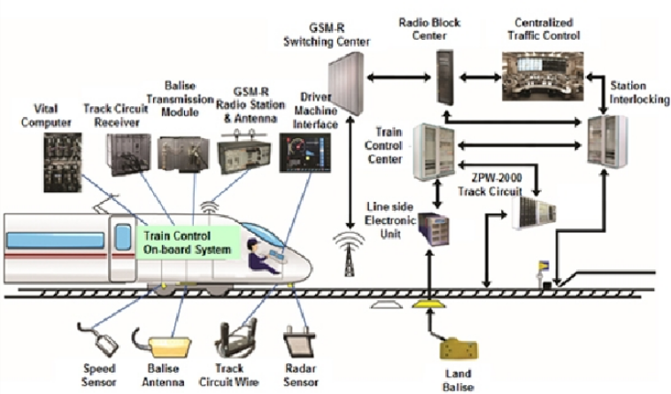
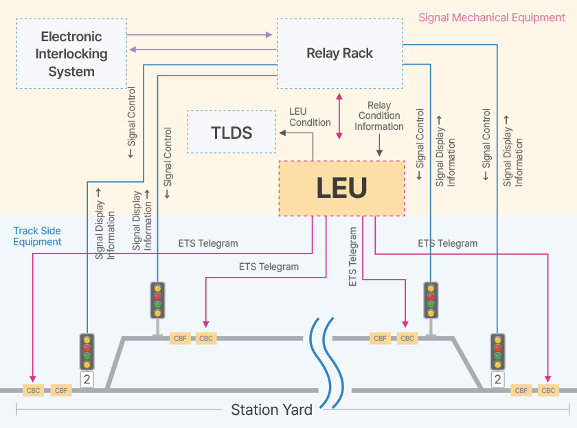
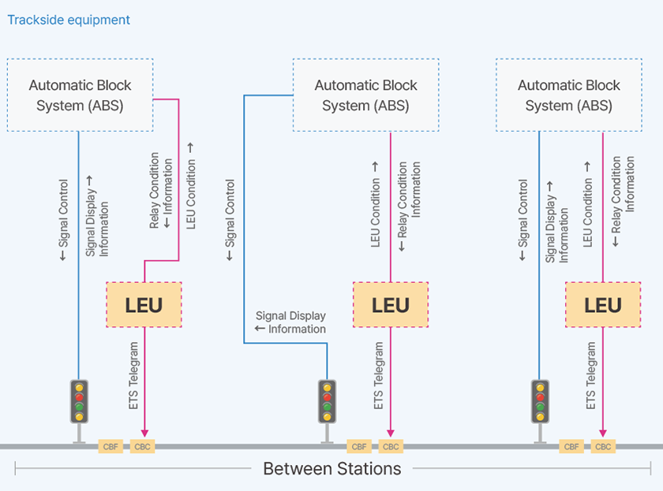
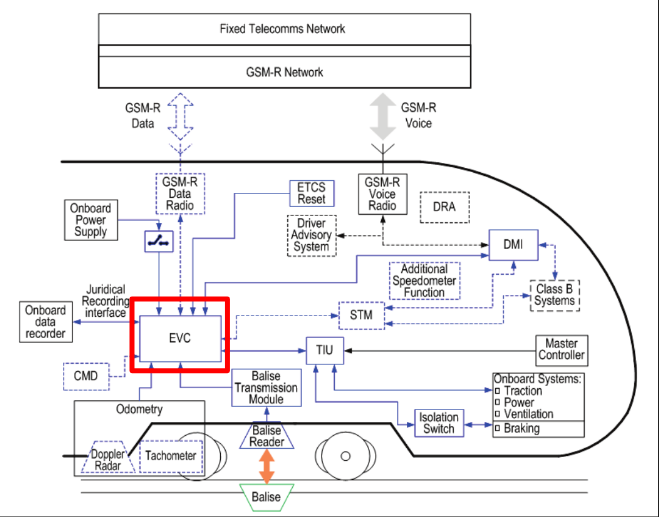
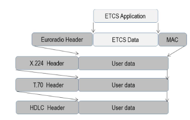

= Cybersecurity for Trains
:description: Yup, I love ASCIIDOCTOR <3.
:organization: Company Name
:doctype: book
:preface-title: Preface
// Settings:
:experimental:
:reproducible:
:icons: font
:listing-caption: Listing
:sectnums:
:toc:
:toclevels: 3
:xrefstyle: short
ifdef::backend-pdf[]
:pdf-theme: chronicles
:pdf-themesdir: {docdir}
:title-logo-image: image:sample-banner.svg[pdfwidth=4.25in,align=center]
:source-highlighter: rouge
//:rouge-style: github
endif::[]

== Introduction

Let us talk about hacking trains. Yes, this is what my talk at NullCon last year was based off of. There, I gave a brief over view of "stuff". Here, I will dive into the technical details. I find these to be more interesting anyway than just the overview.
I got to learn a lot from this research that I previously did not know. So, yeah, this is the research! 

WARNING: This research is for educational purposes only. All of this knowledge is available in the public domain. I have merely applied cybersecurity principles to railway systems.

NOTE: For much of this, I have simply referred to information that is already publicly available. Much of the content here is directly copied from the source. I have cited the sources for further reading.

NOTE: I am by no means an expert at any of this. If you spot a mistake/error, do flag it! A GitHub issue would be much appreciated!

== So, how do railways architect their networks?

This seems like a good place to start. Before we dive into the weaknesses that computers that run the networks of trains face, we should examine the structure of these networks.

Depending on the country you are in, it depends! Being someone who has been trained as an engineer, lets frame this as a system design problem. Given a set of N trains:

* Control room needs to know the current position of trains driver needs to know their location on the track
* Signals and track switching should operate in a way that ensures graceful failure
* Control room needs to be able to manually override signals/track switches
* Drivers and control rooms need to communicate

Along with this, we need to optimize for cost, availability, and efficiency.

We also need to keep the core principals of good system design in mind:

.The core principals of good system design. I've borrowed this from Google footnote:[You find the link to the article here https://cloud.google.com/blog/topics/solutions-how-tos/optimize-your-system-design-using-architecture-framework-principles]
image::https://external-content.duckduckgo.com/iu/?u=https%3A%2F%2Fstorage.googleapis.com%2Fgweb-cloudblog-publish%2Fimages%2Fcore_system_design_princi.0999061019980836.max-2000x2000.jpg&f=1&nofb=1&ipt=465c405dc4d081a426916ee0cd4343720e34e732826173b1556c0e7ac468d69c&ipo=images[]

Given these constrains, the system we would come up with would be pretty similar to the one shown below

.An example system architecture. footnote:[Architecture Image Source: https://www.semanticscholar.org/paper/Applying-GIS-and-multilayered-interactive-cellular-Zhang-Qiu/2b7b999f0a0ae226e1fd32137d94317b69ee71b6]

The above architecture shown above is called as the ETCS or European Train Control System. As the name suggests, is a standard followed throughout Europe. Let's take a deep dive into the ETCS as it comes in handy as a reference architecture. Again, we should note, as mentioned at the start of this section that different countries have different components, however, they usually perform the same/analogous function. India, for example doesn't have an onboard computer called the EVC. They do however, have a computer called as the LRMS which performs much of the same functions that the EVC does in the European model footnote:[https://rskr.irimee.in/sites/default/files/REMMLOT.pdf].

== The ETCS

This has been taken directly from WikiPedia! footnote:etcs[https://en.wikipedia.org/wiki/European_Train_Control_System]

This section covers the knowledge required for a rudimentary understanding of how things work, since we are interested in the cybersecurity aspect of things. If you wish to take a deep dive, you are free to read the ETCS article on Wikipedia, or read the standard that have been put out by the EU.

The European Train Control System (ETCS) is a train protection system designed to replace the many incompatible systems used by European railways, and railways outside of Europe. ETCS is the signalling and control component of the European Rail Traffic Management System (ERTMS).

ETCS consists of 2 major parts:

* trackside equipment
* on-board (on train) equipment

ETCS can allow all trackside information to be passed to the driver cab, removing the need for trackside signals. This is the foundation for future automatic train operation (ATO). Trackside equipment aims to exchange information with the vehicle for safely supervising train circulation. The information exchanged between track and trains can be either continuous or intermittent according to the ERTMS/ETCS level of application and to the nature of the information itself. 

=== Levels of ETCS

ETCS is specified at four numbered levels footnote:etcs[]. 

[cols=2*]
|====
|Level|Description
|0|ETCS-compliant locomotives or rolling stock do not interact with lineside equipment, e.g. because of missing ETCS compliance.
NTC (former STM|)|ETCS-compliant driving cars are equipped with additional Specific Transmission Modules (STM) for interaction with legacy signalling systems. Inside the cabs are standardised ETCS driver interfaces. With Baseline 3 definitions it is called National Train Control.
|1|ETCS is installed at lineside (possibly superimposed with legacy systems) and on board; spot transmission of data from track to train (and versa) via Eurobalises or Euroloops.
|2|As Level 1, but Eurobalises are only used for the exact train position detection. The continuous data transmission via GSM-R with the Radio Block Center (RBC) give the required signalling information to the driver's display. There is further lineside equipment needed, i.e. for train integrity detection.
|3|As Level 2, but train location and train integrity supervision no longer rely on trackside equipment such as track circuits or axle counters. Note that Levels 2 and 3 have been merged as an extended Level 2 in CCS TSI 2023.
|====

=== Trackside equipment

.Track side equipment. This is almost the same as the architecture shown in the previous figure
image::https://transport.ec.europa.eu/sites/default/files/2023-11/ertms-subsystems_0.png[]

==== Eurobalise

The Eurobalise is a passive or active antenna device mounted on rail sleepers. Mostly it transmits information to the driving vehicle. It can be arranged in groups to transfer information. There are Fixed and Transparent Data Balises. Transparent Data Balises are sending changing information from LEU to the trains, e.g. signal indications. 

.Eurobalise
image::https://external-content.duckduckgo.com/iu/?u=https%3A%2F%2Favantetech.com%2Fwp-content%2Fuploads%2FEurobalise-Image.png&f=1&nofb=1&ipt=3cfd879dcc7eef3c8e92fd21c144d3fc2d7a5f5ff189d0bfa2e4b27873636128&ipo=images[]

Fixed Balises are programmed for a special information like gradients and speed restrictions.

==== Euroloop

The Euroloop, is an extension for Eurobalises in ETCS Level 1. It is a special leaky feeder for transmitting information telegrams to the car.

==== Lineside Electronic Unit

The Lineside Electronic Unit (LEU) is the connecting unit between the Transparent Data Balises with signals or Signalling control in ETCS Level 1.

.LEU inputs and outputs in a station yard footnote:leu[http://shinwooeng.co.kr/eng/pro-02.html]

.LEU layout when used between stations footnote:leu[]

==== Radio Block Centre

A Radio Block Centre, is a specialised computing device with specification safety integrity level 4 (SIL) for generating Movement Authorities (MA) and transmitting it to trains. It gets information from signalling control and from the trains in its section. It hosts the specific geographic data of the railway section and receives cryptographic keys from trains passing in. According to conditions the RBC will attend the trains with MA until leaving the section. RBC have defined interfaces to trains, but have no regulated interfaces to Signalling Control and only have national regulation. 

=== Onboard equipment

Operation under ETCS requires that each train be fitted with a number of interlinked on-board systems that monitor the position and the status of the train, and that allow the driver to receive Movement Authorities and interact with the ETCS system. The equipment must be certified by the appropriate Notified Bodies.

.An overview of the onboard equipment of ETCS

==== Driver Machine Interface

.An example of a DMI
image::https://external-content.duckduckgo.com/iu/?u=https%3A%2F%2Fwww.globalrailwayreview.com%2Fwp-content%2Fuploads%2FDMI-screen-in-cab.jpg&f=1&nofb=1&ipt=fabe725e92ae280ae978b835e0940fb721e857c8d62dcd0820869825c496f0a1&ipo=images[]

The Driver-Machine Interface [de] (DMI), formerly "Man-Machine Interface" (MMI), is the standardized interface for the driver. It consists of a set of colour displays that show the train's speed, the ETCS Movement Authority (where relevant), and other information about the status of the ETCS equipment. It is also used to display train control information sourced from pre-ETCS signalling and train protection systems when the train is not under ETCS control. To allow access to setup and configuration menus, the DMI is provided with either a touchscreen or an array of soft keys.

==== Balise Transmission Module

.Balise Transmission Module footnote:[https://www.researchgate.net/publication/343142529/figure/fig1/AS:916282446737410@1595470167332/Structure-of-Balise-transmission-module.jpg]
image::https://www.researchgate.net/publication/343142529/figure/fig1/AS:916282446737410@1595470167332/Structure-of-Balise-transmission-module.jpg[]

The Balise Transmission Module (BTM) is a wireless transceiver that facilitates the traffic of data telegrams between the train and the Eurobalises mounted on the track.

.Balise Transmission Module Block Architecture footnote:[https://www.researchgate.net/publication/382609197/figure/fig1/AS:11431281263581906@1722145204639/Balise-transmission-system-structure-block-diagram.jpg]
image::https://www.researchgate.net/publication/382609197/figure/fig1/AS:11431281263581906@1722145204639/Balise-transmission-system-structure-block-diagram.jpg[]

==== Odometric sensors

The odometric sensors allow the train to determine the distance it has traveled along the track since it last passed a Eurobalise or other known fixed position, which is necessary for the train's ETCS controller to ensure that the train does not proceed past the end of its Movement Authority. A number of different technologies are applied for this purpose, including rotation counters mounted on one or more of the train's axles, accelerometers, and Doppler radar.

==== European Vital Computer

The European Vital Computer [de] (EVC), sometimes referred to as Eurocab, is the heart of train's on-board ETCS equipment. It receives and processes the information received from the train's sensors and communications equipment, sends the display image to the DMI, monitors the train's compliance with Movement Authorities and other operational constraints, and intervenes if necessary to ensure safety by making an emergency brake application or otherwise overriding the driver's controls. Because there is an upper limit to length of the cables that connect the EVC to the other ETCS components, longer multiple-unit trains can sometimes require a separate EVC for each driver's cab.

==== Euroradio

The Euroradio communication unit is for both voice and data communication. Because in ETCS Level 2 all signalling information is exchanged via GSM-R, the radio equipment is capable of maintaining two simultaneous connections to the ETCS Radio Block Centre.

.Euroradio protocol packet structure footnote:[https://encrypted-tbn0.gstatic.com/images?q=tbn:ANd9GcQoVBcnXnUSNvGiPbn6wk0_e_qFM_SOhtcGww&s]

==== Juridical Recording Unit

.A rack mounted JRU
image::https://upload.wikimedia.org/wikipedia/commons/d/d7/DR3000_On_Train_Data_Recorder.png[]

The Juridical Recording Unit (JRU) is an event recorder, usually integrated with the EVC, that logs the actions of the driver and the state of both the signalling and the ETCS equipment itself. It can be considered equivalent to an aircraft's flight recorder.

==== Train Interface Unit

The Train Interface Unit (TIU) is the interface between the EVC and the train/locomotive, for submitting commands or receiving information.

==== Specific Transmission Modules

A Specific Transmission Module (STM) is a special interface for the EVC that enables operation with one or more Class B ATP systems, such as PZB, MEMOR, or ATB. It consists of the hardware needed to link the specific sensors and receivers that pick up on-track and lineside signals from the legacy installation with the EVC, and the software that allows the EVC to emulate the processing functions that would be performed by the legacy system controller on a non-ETCS train. The information provided by the legacy system is then shown to the driver via the DMI. It is possible to fit an EVC with STMs for multiple legacy systems, as required

=== Protocols that are commonly used for communication between the various components

Modern trains use a combination of CAN, TrainBUS, Ethernet, and MVB(Multifunction Vehicular Bus).

.Various protocols and the way different components inter-communicate with each other
image::https://www.railjournal.com/wp-content/uploads/2022/02/LocoTech-Signal_Image1.jpg[]

I feel the need to do a deep dive into the communication protocols that are commonly used by trains at a later point in time.